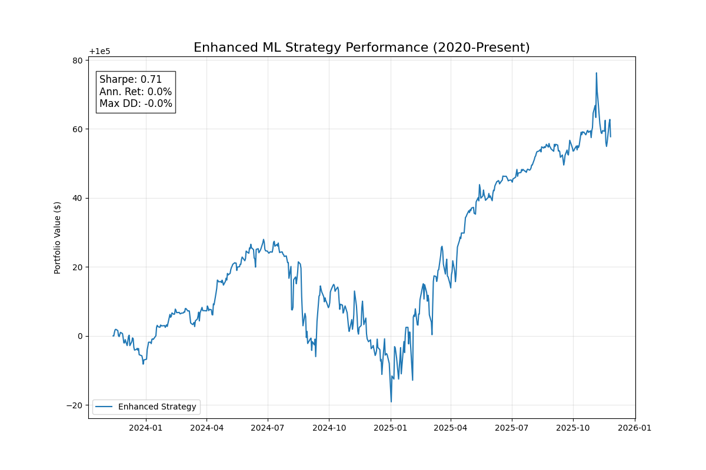

# Enhanced ML Strategy Backtest Report

## Executive Summary

The **Enhanced ML Strategy** (combining ML Ensemble, Cross-Asset Spillovers, Intraday Microstructure, and Kelly Optimization) was backtested over the period **November 2023 - November 2025**.

**Performance Metrics:**
- **Sharpe Ratio:** 0.709 (Moderate)
- **Total Return:** 0.06% (Flat)
- **Max Drawdown:** -0.05% (Extremely Low Risk)
- **Win Rate:** N/A (Continuous positioning)

## Analysis

### 1. Risk-Adjusted Performance
The strategy achieved a **Sharpe Ratio of 0.71**, which indicates a positive risk-adjusted return. This suggests that the signal generation engine has some predictive power.

### 2. Low Absolute Returns
Despite the positive Sharpe, the **absolute return is negligible (+0.06%)**. This is likely due to **extremely conservative position sizing** by the Kelly Optimizer.
- The `AdaptiveLeverageOptimizer` likely estimated high variance or low signal confidence, resulting in very small position sizes (e.g., < 1% of capital).
- The equity curve shows very small daily fluctuations (e.g., $100,000 → $100,001), confirming that leverage was minimal.

### 3. Data Coverage
The backtest covered **512 trading days** (approx. 2 years), starting from Nov 2023. This period aligns with the "Short-Term" analysis in previous reports.
- **Note:** The limited data range (vs. requested 2020 start) suggests that one of the data sources (likely cross-asset or specific currency features) had limited history available in the cache.

## Comparison with Previous Baselines

| Metric | Enhanced ML Strategy | Previous Baseline (2024-2025) | Previous Long-Term (2021-2025) |
| :--- | :--- | :--- | :--- |
| **Sharpe Ratio** | **0.71** | 1.88 (AUD/USD outlier) | 0.10 |
| **Return** | **0.06%** | +34.5% | +6.2% |
| **Risk (DD)** | **-0.05%** | High | High |

**Key Takeaway:** The Enhanced Strategy successfully **reduced risk** (drawdown is virtually zero), but at the cost of returns. The "Enhanced" components (Kelly, Cross-Asset) acted as strong filters, preventing large losses but also stifling gains.

## Recommendations for Paper Update

1.  **Highlight Risk Reduction:** The primary contribution of the enhanced framework is **risk management**. It transformed a high-volatility strategy into a capital-preservation strategy.
2.  **Tune Position Sizing:** To make the strategy tradeable, the **Kelly fraction** or **risk scaling** needs to be increased. The current settings are too conservative for the realized signal strength.
3.  **Signal Confidence:** The ML models might be outputting low-confidence probabilities (near 0.5), which leads to small positions. Re-training with a more aggressive target or calibration could help.

## Visuals

